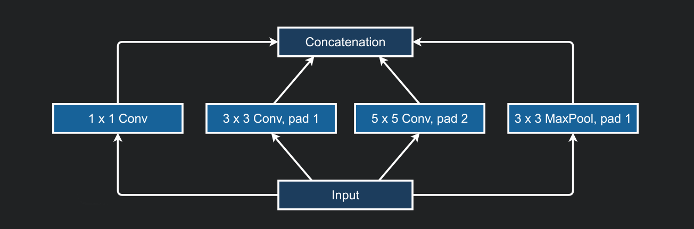
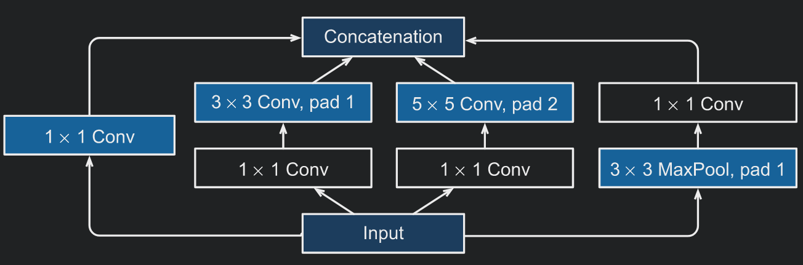
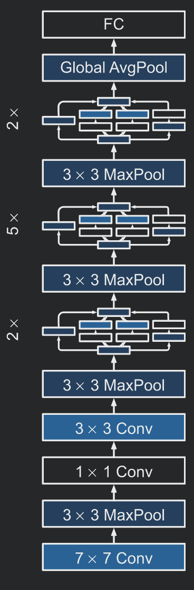
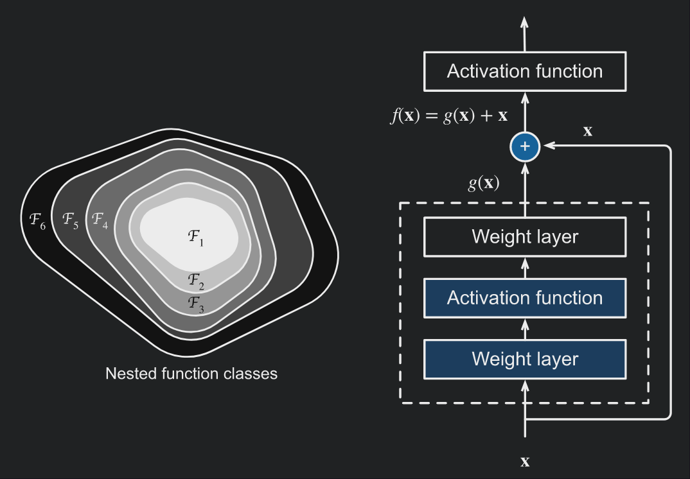
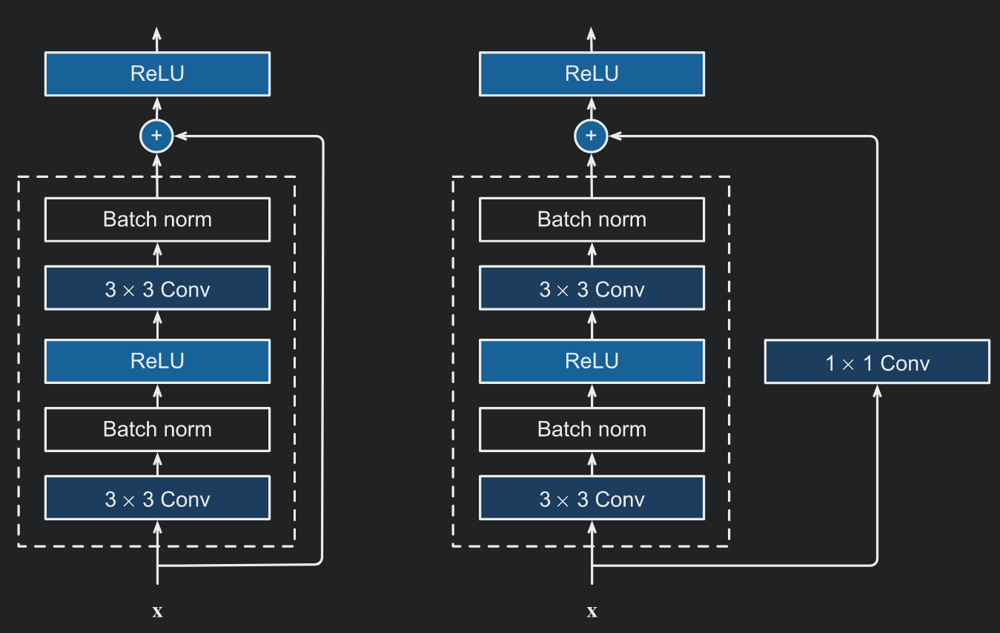
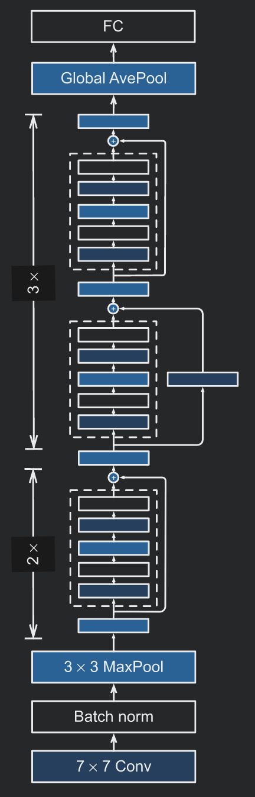
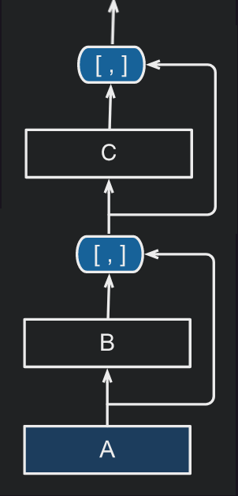

# DEEP CONVOLUTIONAL NETWORKS

## INCEPTION (GoogLeNet)
GoogLeNet won the ImageNet Challenge in 2014. The architecture of the model is
presented in:
  * *Going deeper with convolutions* by Szegedy et. al.,
  ([here](https://arxiv.org/abs/1409.4842))

Instead of trying to identify which convolution, ranging from `1x1` to `11x11`,
would be best, this model simply concatenates multi-branch convolutions. An
inception block applies four different convolution blocks separately on the same
input feature map: a `1x1`, `3x3`,`5x5` convolution, and a max pool operation.
Finally, it concatenates the outputs along the channel dimensions. The design
aligns with the intuition that visual information should be processed at various
scales and then aggregated so that the next stage can abstract features from
different scales simultaneously.

One big problem with this naive form is that even a modest number of `5x5`
convolutions can be prohibitively expensive on top of a convolutional layer with
a large number of filters. This problem becomes even bigger because of the use
of a max pool layer in the mix. The max pool branch would output the same number
of filters as its input, thus the output of the inception block would inevitably
grow in filter size. For this reason `1x1` convolutions are used to compute
reductions before the expensive `3x3` and `5x5` convolutions, and also after the
max pool operation. They also include the use of a `relu` non-linearity.

This networks works so well because of the combination of different filter sizes.
They explore the image on different scales, meaning that details at different
extents can be recognized efficiently by the different filters. The commonly
tuned hyper-parameters of the Inception block are the number of output channels
for each of the branches, i.e., how to allocate capacity along the convolutions
of different size. The main intuition is to have the most filters for the `3x3`
convolutions as they are powerful enough to take the context into account while
requiring almost a third of the parameters of the `5x5` convolution.

The GoogLeNet architecture consists of stacking multiple Inception blocks with
occasional max pooling to reduce the height and the width of the feature maps.
It exhibits a clear distinction among the stem (data ingest), body (data
processing), and head (prediction). This design pattern has persisted ever since
in the design of deep networks.

The original design also included auxiliary classifiers (small neural nets)
connected to intermediate layers (first and fifth block of the five layer module)
in order to stabilize training. By adding these auxiliary classifiers,
the authors state that they increase the gradient signal that gets propagated
back and also provide additional regularization. During training their loss gets
added to the total loss of the network with a discount weight (`w=0.3`). These
tricks to stabilize training are no longer necessary due to the availability of
improved algorithms.

## RESNET
ResNet won the ImageNet Large Scale Visual Recognition Challenge in 2015.
The architecture of the model is presented in:
  * *Deep residual learning for image recognition" by He et. al.,
  ([here](https://arxiv.org/abs/1512.03385))

The problem that the authors of the ResNet model were trying to solve was how
can we design deeper networks such that adding layers makes the network strictly
more expressive rather than just different. Let $\mathcal{F}$ be the class of
functions that a specific network architecture can reach, and $\mathcal{F}'$ be
the class of functions that a deeper, more powerful architecture can reach. We
are guaranteed that the expressive power of the network increases, only if the
function class of the smaller network is contained in the function class of the
larger network ($\mathcal{F} \in \mathcal{F}'$).

Assuming we extend the model architecture with one more layer, then if we can
train this newly-added layer into an identity function `f(x) = x`, the new
function class will contain the old one. At the heart of the proposed residual
network (ResNet) is the idea that every additional layer should easily contain
the identity function as one of the elements of its class of functions. Instead
of modelling the new layer as `f(x)` we will model it as `f(x) = g(x) + x`. If
the identity mapping is the desired underlying function, then the residual
mapping amounts to `g(x) = 0` and it is thus easier to learn.

The residual block models the residual function `g(x)` using two `3x3`
convolutional layers with the same number of output channels. Each convolutional
layer is followed by a normalization layer and a ReLU activation function. The
input is added to the residual directly before the final ReLU activation
function. Note that this design requires that the output of the two convolutional
layers has to be of the same shape as the input, so that they can be added
together. Changing the number of channels is done by introducing an additional
`1x1` convolutional layer to transform the input into the desired shape.

The design of the ResNet follows the stem, body, head layout of GoogLeNet. The
body uses four modules made up of residual blocks. The first module consists of
two stacked residual blocks. The next three modules have the following structure:
first a residual block that doubles the channels and halves the spatial dimensions,
and then a normal residual block. Reduction of the spatial dimensions is done
using strides in the convolution. There are 4 convolutional layers in each module
(excluding the `1x1` convolutional layers). Together with the first convolutional
layer and the final fully-connected layer, there are 18 layers in total, hence
the name ResNet-18.

## DENSENET
The architecture of the DenseNet model is presented in:
  * *Densely connected convolutional networks" by Huang et. al.,
  ([here](https://arxiv.org/abs/1608.06993))

DenseNets also make use of residual connections, however, instead of adding the
output of the residual and the input, dense networks simply concatenate them.
A dense block consists of multiple convolutional layers in a sequence. In the
forward pass the input and the output of each layer are concatenated along the
channel dimension before passing on to the next layer.

Since the number of channels is continuously increasing due to the concatenation,
adding too many layers in the block would lead to an excessively large model.
Thus, a transition layer is placed between dense blocks and is responsible for
reducing the dimensionality of the input.